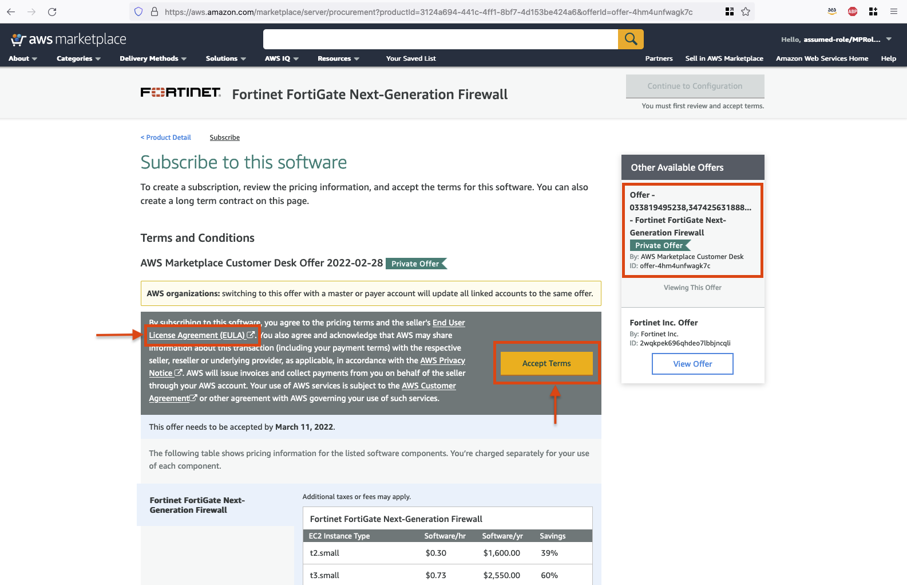

In this section, you will accept the private offer that was previously generated.

### Accept the Private Offer 

If you are using, one of the pre-provisioned accounts, a private offer is already extended to this account. For step-by-step instructions on how to create private offer (steps commonly used by Sellers), watch this [pre-recorded video](https://amazon.awsapps.com/workdocs/index.html#/document/0ab2f7879b6679d9cd7742b866f416610e1fd12c3feeb1cbbe57d8922f3eac7d)

In this workshop you will navigate through the steps involved as a buyer/customer.

1. When seller/partner generates a Private offer, an email will be sent to the customer with a link that looks like below:

    *Example:* (**DO NOT** click on this link): https://aws.amazon.com/marketplace/fulfillment?productId=3124a694-441c-4ff1-8bf7-4d153be424a6&offerId=offer-4hm4unfwagk7c

2. Retrieve the link associated with your account from the [QUIP doc, Column-F, Private Offer Link](https://quip-amazon.com/gjPNAQd43TZM/AWSMP-CA-Training-LabEnvs-03042022#s:PHE9CAZWwTJ;PHE9CA3MJ56) 

3. Copy and paste the above link in the browser where you previously opened the AWS Console.

4. Choose **End User License Agreement (EULA)** to review the terms.

5. Choose **Accept Terms** to accept the private offer. 

    