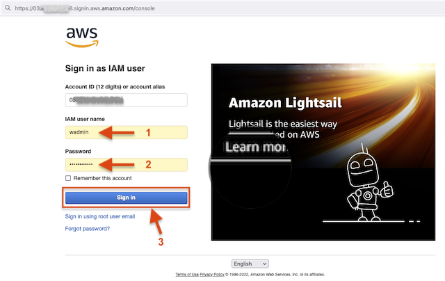
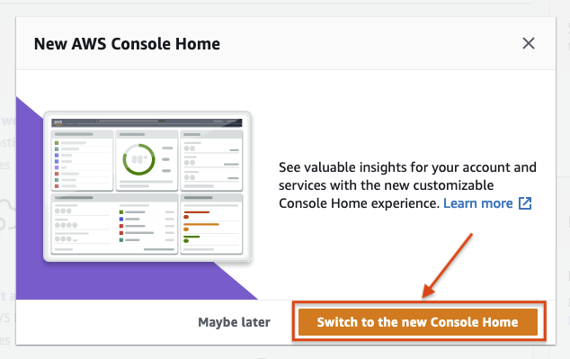
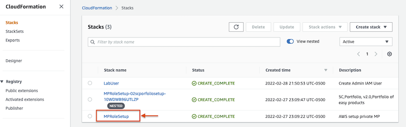
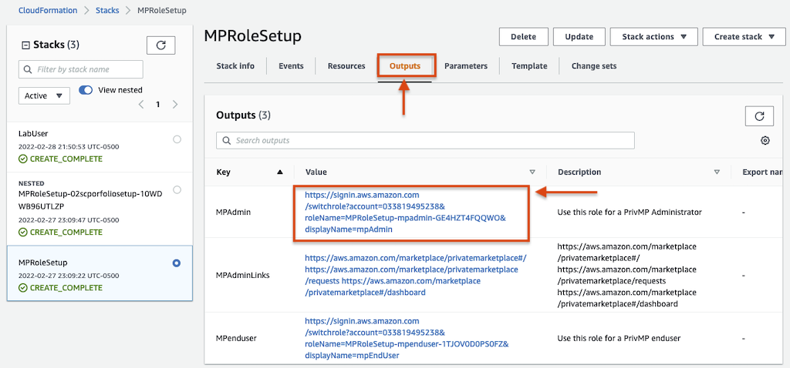
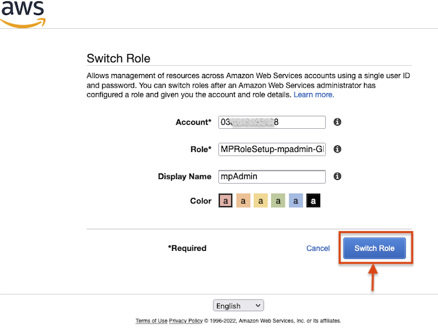

In this section, you will login to the AWS Console with the pre-provisioned username / password. The user will have restricted permissions.

You will then assume the role as Marketplace Administrator and continue the remaining operations.

### Access the AWS Console

1. Click on the hyperlink in `Column-E - Console Access` to open AWS Console in your default browser. 
    
   Alternatively type in https://`YOUR-ACCOUNT-ID-UPDATE-ME`.signin.aws.amazon.com/console in the browser.

    

2. When opted, choose **Switch to new Console Home**

    

You can now access the  AWS Console.

### Switch role as an AWS Marketplace Administrator 

The required IAM are provisioned using the CloudFormation. Follow instructions below to login as Marketplace Admin.

1. Navigate to **Services**, **Management & Governance**, **CloudFormation** or choose [CloudFormation Console](https://console.aws.amazon.com/cloudformation/home?region=us-east-1#/stacks) to access pre-provisioned Stacks. **Note:** If you do not see any stacks in your account, please verify you are in `us-east-1` region.

    

2. Choose **MPRoleSetup**, **Outputs** to access quick links to login as AWS Marketplace Administrator

    

3. Click on the Value next to Key **MPAdmin** to open below screen.

    

4. Choose **Switch Role** to login as AWS Marketplace Administrator. 

